<!-- Welcome words -->
<h1 style="color: #c1ea09;">Welcome to Lewen's GitHub! 👋</h1>

<!-- Little Logo -->

  

    
  

<!-- Stats Words -->

  

<!-- Skills Emoji -->

<!-- 3D GitHub Contribution -->
<picture>
  <source media="(prefers-color-scheme: dark)" 
          srcset="https://github.com/Lewen-WangCC/Lewen-WangCC/blob/main/profile-3d-contrib/profile-night-view.svg" />
  <source media="(prefers-color-scheme: light)" 
          srcset="https://github.com/Lewen-WangCC/Lewen-WangCC/blob/main/profile-3d-contrib/profile-south-season-animate.svg" />
  
</picture>

<!-- GitHub Activity Graph -->
<table>
  <tr>
    <td>
      <picture>
        <source media="(prefers-color-scheme: dark)"  
                srcset="https://github-readme-activity-graph.vercel.app/graph?username=Lewen-WangCC&theme=github-dark" />
        <source media="(prefers-color-scheme: light)" 
                srcset="https://github-readme-activity-graph.vercel.app/graph?username=Lewen-WangCC&theme=vue" />
        
      </picture>
    </td>
  </tr>
</table>

<!--
**Lewen-WangCC/Lewen-WangCC** is a ✨ _special_ ✨ repository because its `README.md` (this file) appears on your GitHub profile.

Here are some ideas to get you started:

- 🔭 I’m currently working on ...
- 🌱 I’m currently learning ...
- 👯 I’m looking to collaborate on ...
- 🤔 I’m looking for help with ...
- 💬 Ask me about ...
- 📫 How to reach me: ...
- 😄 Pronouns: ...
- ⚡ Fun fact: ...
-->
